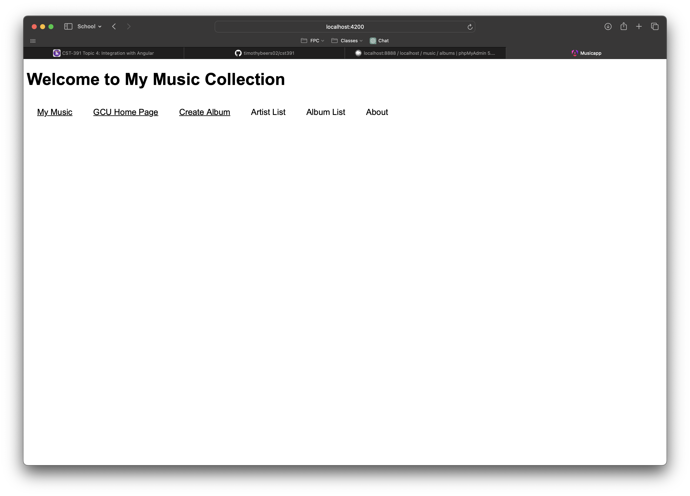
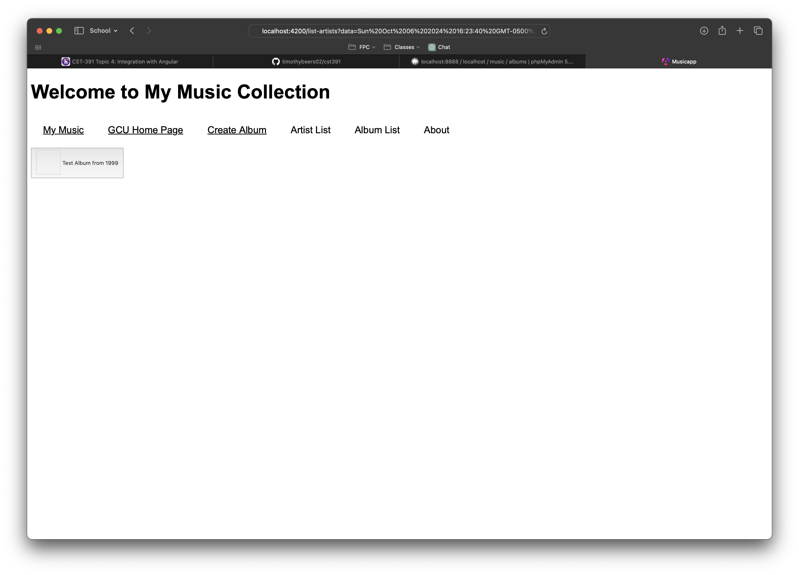
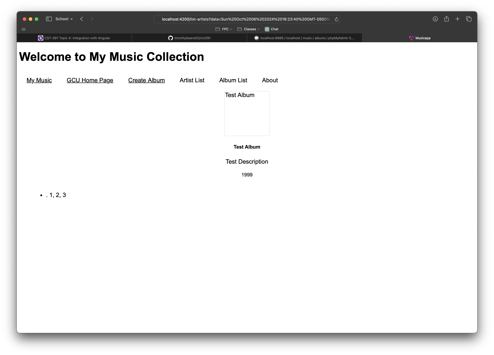
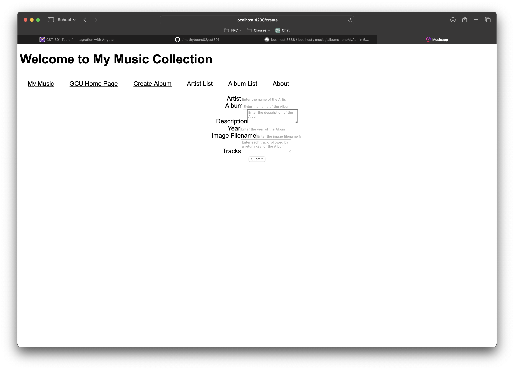

# Activity 4

<!-- 1. Cover Sheet -->
Kaya Nelson \
College of Science, Engineering, & Technology, Grand Canyon University \
CST-391: JavaScript Web Application Development \
Professor Bobby Estey

## Introduction

In this activity, we’ll be replacing the placeholder data with a real-time connection to our Music API. This integration will allow us to fetch and showcase dynamic content, including albums and artists. Additionally, we’ll set up interactive forms that enable users to create and manage these entries directly through the API, providing a more engaging and functional user experience. 
## Screenshots

This screenshot highlights the landing page of our application. It keeps a clean and minimalist design, featuring a navigation bar that provides easy access to the different pages we've incorporated. This straightforward layout ensures users can quickly find their way around the app without any distractions.

This screenshot displays the collection of artists retrieved from our API. It showcases the dynamic content populated directly from the server, allowing users to view a curated list of artists seamlessly integrated into our application.

This screenshot features a representation of the albums being fetched from the API. While I'm currently showcasing just a single album due to some challenges with displaying the full list, it highlights the intended layout and design for presenting multiple albums. Once resolved, users will be able to navigate through a comprehensive collection of albums seamlessly integrated into our application.

This is the detailed album page, which presents comprehensive information about the album, including a complete list of tracks. It provides users with an in-depth look at the album's content, enabling them to explore each song and its associated details in a structured format. This layout enriches the user experience by delivering all relevant information in one accessible location.

This showcases the "Add Album" page of our application, where users can submit new albums via our API. Once an album is added, it will be visible in the album listings, allowing others to discover it easily. This feature enhances the application's functionality by enabling users to contribute their own music entries directly, fostering a more interactive and engaging environment.

## Research

In an Angular application, managing the logged-in state usually involves using authentication tokens that are stored in the browser's local storage or session storage. Here's how it typically works:

        1. User Login: When a user logs in, the server generates an authentication token, which is sent back to the client.
        2. Token Storage: The client stores this token locally in either local storage or session storage. Local storage retains data even after the browser is closed, while session storage only retains it for the duration of the page session.
        3. Making Requests: For subsequent interactions with the server, this token is included in the headers of HTTP requests. This token acts as proof that the user is authenticated.
        4. HTTP Interceptors: Angular's HTTP interceptors can be employed to automatically attach the token to outgoing requests. This simplifies the process, so developers don't need to manually handle token attachment each time.
        5.Server Validation: Upon receiving the token, the server validates it to verify the user's identity and authorization. If the token is valid, the server processes the request; if not, it can respond with an unauthorized status.
This approach provides a secure and efficient way to manage user authentication, ensuring that users have the necessary privileges to access protected resources within the application.

## Conclusion

In this activity, we transitioned our Angular application from using mock data to establishing a live connection with our API. This significant shift involved several key steps:

        1. Removing Mock Data: We eliminated the previously used mock data that simulated API responses. This step was crucial for moving towards a more dynamic and real-world application experience.
        2. Refactoring Music Service: Our music service methods were refactored to utilize callbacks. This change allows the service to handle asynchronous operations effectively, enabling consumers of the service to manage the resulting objects and operations in a more flexible manner.
        3. Testing the Application: After implementing the updates, we conducted thorough tests on the application to verify that the API connection was functioning correctly. This included checking that data retrieval and submission worked as expected.
        4. Creating and Viewing Albums: We successfully demonstrated the API's functionality by creating an album complete with tracks. This new album could then be viewed on the associated pages, showcasing the real-time data flow and enhancing the user experience.
Overall, these updates not only improved the application's responsiveness and interactivity but also laid the foundation for future enhancements and features driven by live data.
