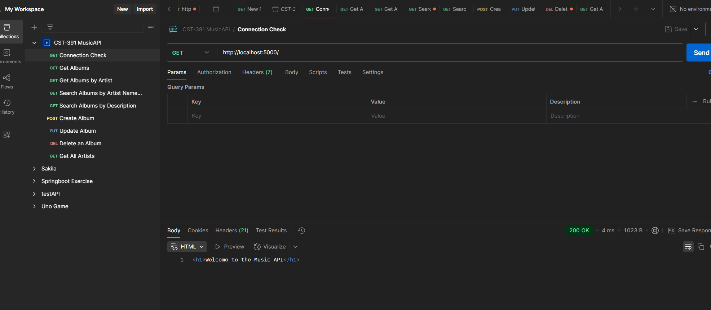
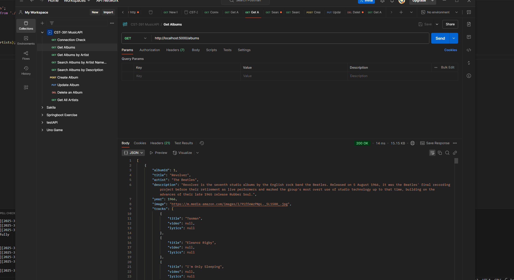
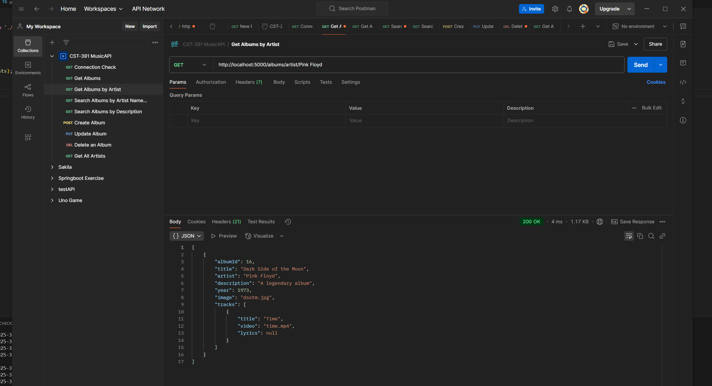
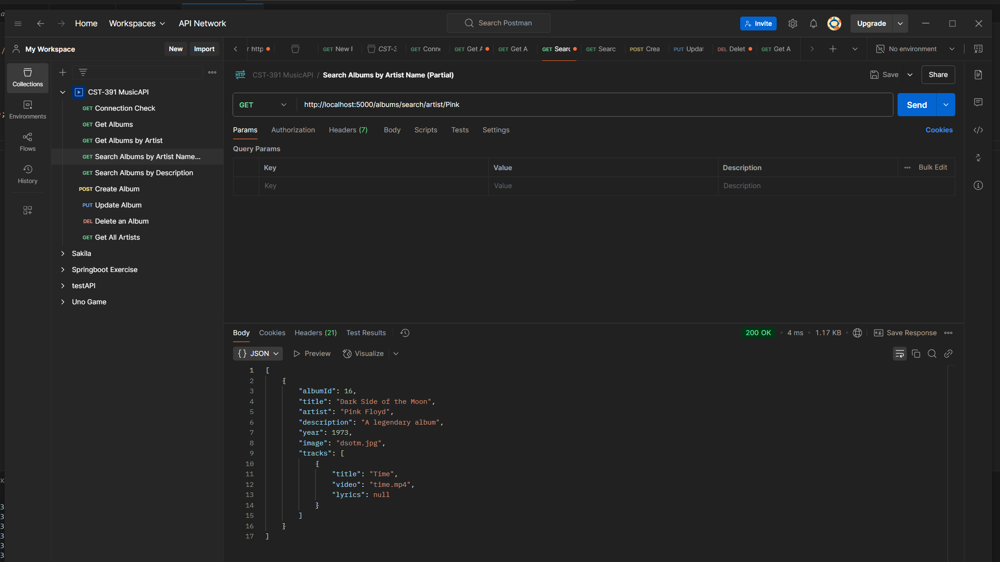
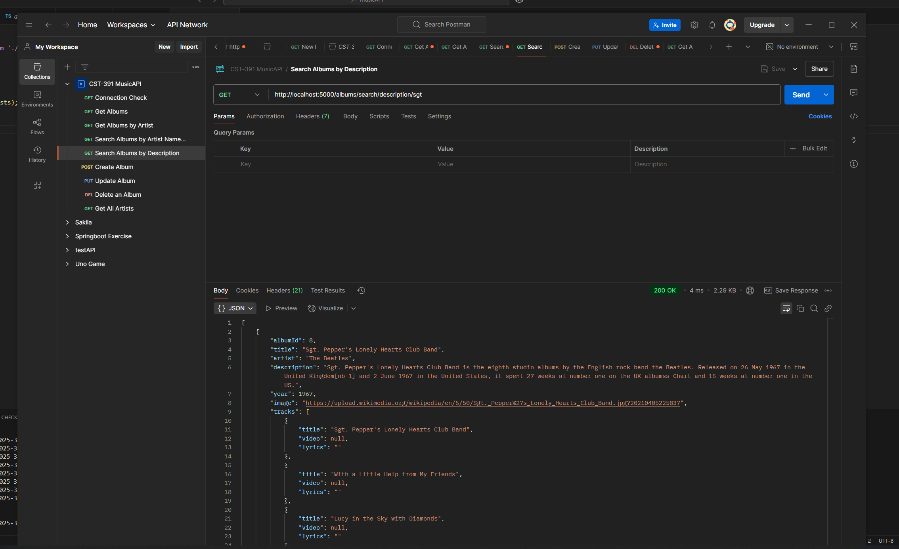
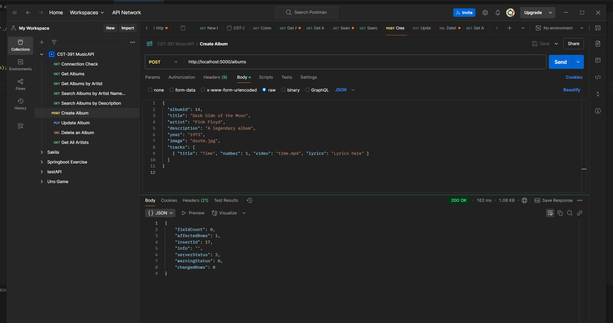
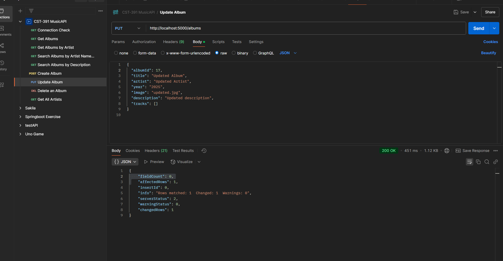
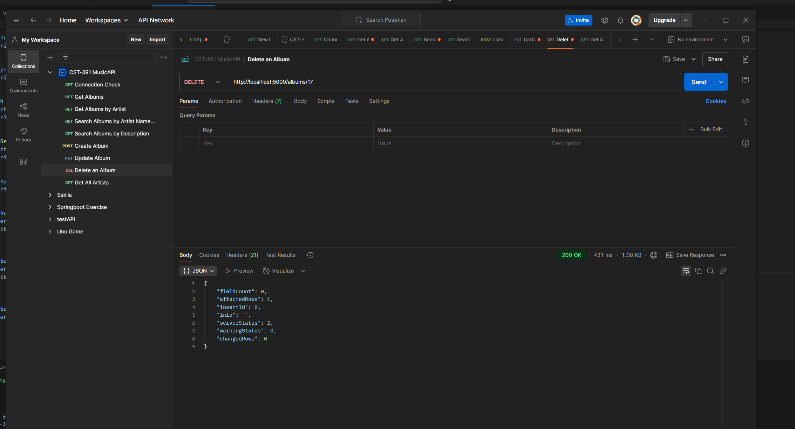
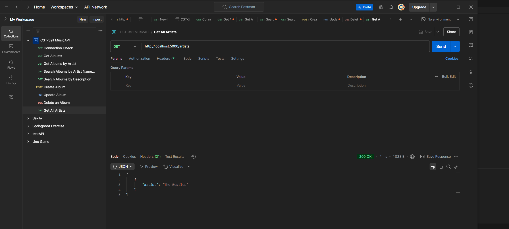

# Activity 1: Express API  
**CST-391 JavaScript Web Application Development**  
**Kaya Nelson**

This document provides an in-depth overview of the **MusicAPI**, detailing the nine key endpoints available for interaction. Each endpoint is designed to facilitate various operations related to music products, enhancing the overall user experience in managing a music store's inventory and customer interactions. Additionally, a screencast recording link is included for visual guidance on utilizing the API effectively.

---

## Table of Contents
1. [Connection Check](#connection-check)
2. [Get All Albums](#get-all-albums)
3. [Get Albums by Artist](#get-albums-by-artist)
4. [Search Albums by Name](#search-albums-by-name)
5. [Search Albums by Description](#search-albums-by-description)
6. [Create Album](#create-album)
7. [Update Album](#update-album)
8. [Delete Album](#delete-album)
9. [Get All Artists](#get-all-artists)
10. [Screencast Recording](#screencast-recording)

---

## 1) Connection Check
**Endpoint:** `GET http://localhost:5000/`  
**Screenshot:**  


**Description:**
This endpoint confirms that the server is running correctly by returning a simple HTML response. When accessed, it provides the following output: `<h1>Welcome to the Music API</h1>` response.

---

## 2) Get All Albums
**Endpoint:** `GET http://localhost:5000/albums`  
**Screenshot:**  


**Description:**  
This endpoint retrieves a list of all albums stored in the database. It provides valuable information for users looking to explore music collections.

---

## 3) Get Albums by Artist
**Endpoint:** `GET http://localhost:5000/albums/artist/The Beatles`  
**Screenshot:**  


**Description:**  
This endpoint retrieves a list of albums for a specific artist. For this example, we will focus on **"The Beatles."**
---

## 4) Search Albums by Name
**Endpoint:** `GET http://localhost:5000/albums/search/artist/Beat`  
**Screenshot:**  


**Description:**  
This endpoint retrieves a list of albums where the artist's name contains a specific substring. In this case, we will search for artists whose names include `"Beat"`.

---

## 5) Search Albums by Description
**Endpoint:** `GET http://localhost:5000/albums/search/description/sgt`  
**Screenshot:**  


**Description:**  
This endpoint retrieves a list of albums where the album description contains a specific substring. In this case, we will search for albums with descriptions that include `"sgt"`.

---

## 6) Create Album
**Endpoint:** `POST http://localhost:5000/albums`  
**Screenshot:**  


**Body (JSON Example):**
```json
{
  "title": "Dark Side of the Moon",
  "artist": "Pink Floyd",
  "description": "A legendary album",
  "year": "1973",
  "image": "dsotm.jpg",
  "tracks": [
    { "title": "Time", "number": 1, "video": "time.mp4", "lyrics": "Lyrics here" }
  ]
}
```

**Description:**  
This endpoint allows you to insert a new album into the database. Upon a successful addition, the response will typically include an `insertId` for the newly created record.

---

## 7) Update Album
**Endpoint:** `PUT http://localhost:5000/albums`  
**Screenshot:**  


**Body (JSON Example):**
```json
{
  "albumId": 1,
  "title": "Updated Album",
  "artist": "Updated Artist",
  "year": "2025",
  "image": "updated.jpg",
  "description": "Updated description",
  "tracks": []
}
```

**Description:**  
This endpoint allows you to update the information of an existing album in the database. Upon a successful update, the response will confirm whether the operation was successful.

---

## 8) Delete Album
**Endpoint:** `DELETE http://localhost:5000/albums/1`  
**Screenshot:**  


**Description:**  
This endpoint allows you to delete an album from the database using its ID. Upon successful deletion, the response will confirm the operation.

---

## 9) Get All Artists
**Endpoint:** `GET http://localhost:5000/artists`  
**Screenshot:**  


**Description:**  
This endpoint retrieves a distinct list of artists from the database. It ensures that each artist is listed only once.

---

## 10) Screencast Recording
**Link:** [**https://go.screenpal.com/watch/cTe6hjn1pkW**](#)

**Description:**  
A video demonstration of each endpoint in Postman, along with a detailed explanation of one API method (router → controller → DAO).

---

**End of Document**
