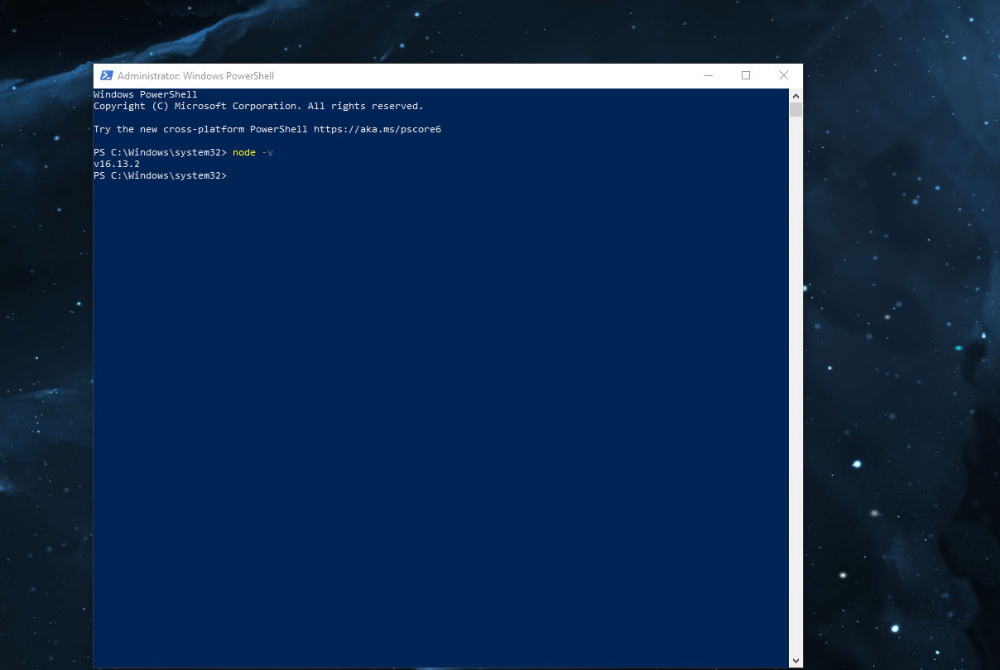
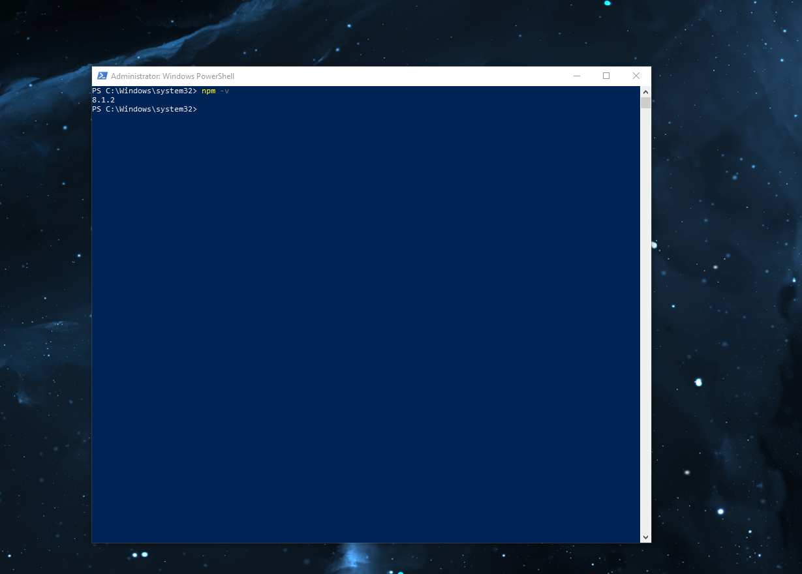
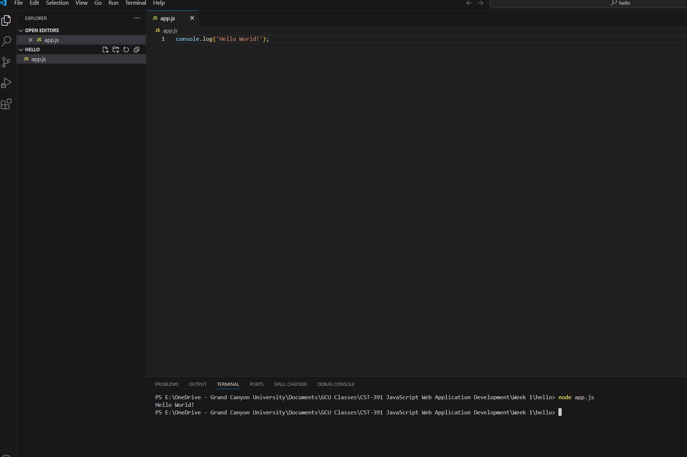
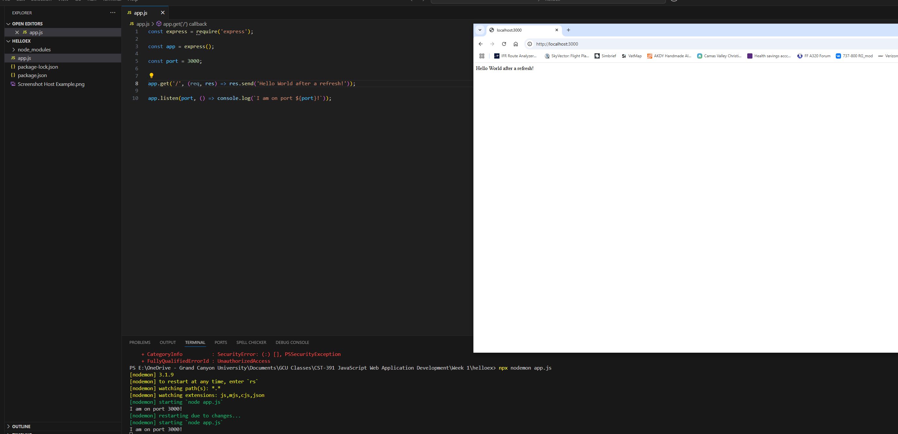
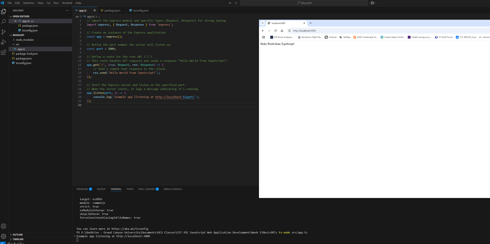
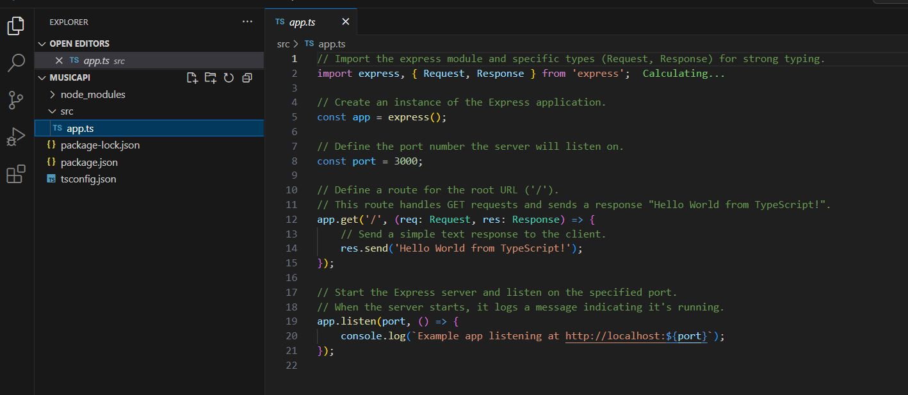

# 📌 CST-391 Activity 0: Tools Installation and Initial Applications

## **📂 Project Structure**
This repository contains three sub-projects under **Activity 0**:
1. **hello** → Basic Node.js console "Hello World" application.
2. **helloex** → Express.js "Hello World" application running in a browser.
3. **MusicAPI** → TypeScript-based Node.js web service.

---

## **1️⃣ NodeJS and NPM Installation**
### ✅ **Verify Node.js Installation**
Run the command:
```bash
node -v
```
**Screenshot:**


### ✅ **Verify NPM Installation**
Run the command:
```bash
npm -v
```
**Screenshot:**


---

## **2️⃣ Hello World Console Application (hello/)**
### **app.js Code**
Create a file named `app.js` inside the `hello/` folder with the following content:
```javascript
console.log('Hello World!');
```
### **Run the Application**
```bash
node app.js
```
**Screenshot:**


---

## **3️⃣ Express "Hello World" Application (helloex/)**
### **Install Express**
Navigate to the `helloex/` folder and run:
```bash
npm init -y
npm install express
```
### **app.js Code**
Create `app.js` inside `helloex/`:
```javascript
const express = require('express');
const app = express();
const port = 3000;

app.get('/', (req, res) => res.send('Hello World!'));

app.listen(port, () => console.log(`Example app listening on port ${port}!`));
```
### **Run the Server**
```bash
node app.js
```
Open a browser and visit: [http://localhost:3000](http://localhost:3000)  

**Screenshot:**


---

## **4️⃣ Nodemon Utility**
### ✅ **Install nodemon**
```bash
npm install -g nodemon
```
### ✅ **Run Server with nodemon**
```bash
nodemon app.js
```
Modify `app.js`, refresh the browser, and check if it updates automatically.

**Screenshot:**


---

## **5️⃣ TypeScript "Hello World" API (MusicAPI/)**
### **Set Up the Project**
Navigate to `MusicAPI/` and run:
```bash
npm init -y
npm install express
npm install --save-dev typescript @types/express
```
### **Create `src/app.ts`**
```typescript
import express, { Request, Response } from 'express';

const app = express();
const port = 3000;

app.get('/', (req: Request, res: Response) => {
    res.send('Hello World from TypeScript!');
});

app.listen(port, () => {
    console.log(`Example app listening at http://localhost:${port}`);
});
```
### **Install TypeScript Compiler**
```bash
npm install typescript@latest -g
tsc --init  # Generates tsconfig.json
```
### **Run the TypeScript Application**
```bash
ts-node src/app.ts
```
**Screenshot:**


---

## **6️⃣ Commented `app.ts` File**
Here’s the **fully documented TypeScript app**:
```typescript
// Import Express framework and Request, Response types for strong typing
import express, { Request, Response } from 'express';

// Create an Express app instance
const app = express();

// Define the port the server will listen on
const port = 3000;

// Define a GET endpoint that responds with "Hello World from TypeScript!"
app.get('/', (req: Request, res: Response) => {
    // Send a response back to the client
    res.send('Hello World from TypeScript!');
});

// Start the Express server and listen on the defined port
app.listen(port, () => {
    console.log(`Example app listening at http://localhost:${port}`);
});
```
**Screenshot:**
